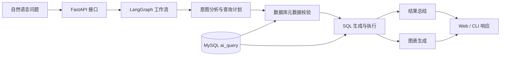

# 智能问数（Intelligent Data Query）

基于 **FastAPI + LangGraph + MySQL + OpenAI-compatible LLM** 的本地智能问数平台。项目将自然语言业务问题解析为结构化查询计划，结合数据库元数据生成安全 SQL，返回可读的业务结论，并在适合的场景下生成图表。

> 使用声明：本项目用于学习、课程设计、项目展示和本地功能验收；查询结果依赖本地数据库内容与模型配置，不应替代正式的数据治理、财务审计或业务决策流程。

## 目录

- [核心能力](#核心能力)
- [系统架构](#系统架构)
- [技术栈](#技术栈)
- [快速开始](#快速开始)
- [API 概览](#api-概览)
- [查询流程与安全策略](#查询流程与安全策略)
- [数据模型与数据流](#数据模型与数据流)
- [项目结构](#项目结构)
- [测试与验证](#测试与验证)
- [已知边界](#已知边界)
- [License](#license)

## 核心能力

| 模块 | 说明 |
| --- | --- |
| 自然语言问数 | 用中文查询 GMV、订单量、销售额、地区排名和品类对比等业务指标。 |
| 意图分析 | 通过 LLM 识别目标表、字段、聚合方式、排序和筛选条件。 |
| 结构化查询计划 | 使用 Pydantic 模型约束查询计划，降低模型输出不完整或格式错误的风险。 |
| 安全 SQL 生成 | 基于数据库元数据和允许的表字段生成参数化查询，避免直接执行模型原始文本。 |
| 结果总结 | 将查询结果整理为适合业务阅读的自然语言结论。 |
| 自动图表 | 支持柱状图、条形图、折线图和饼图等常见可视化输出。 |
| 会话上下文 | 通过 `session_id` 保存问答历史，支持连续追问。 |
| Web 工作台 | 提供问题输入、结果展示、数据模型、系统状态和执行链路页面。 |

## 系统架构



运行时，接口接收问题后进入 LangGraph 工作流；意图分析节点生成结构化计划，查询节点通过 MySQL 访问数据，结果格式化节点生成业务摘要，图表节点按需输出可视化结果。

## 技术栈

| 类型 | 技术 |
| --- | --- |
| 后端 | Python 3.12+、FastAPI、Uvicorn |
| 工作流 | LangGraph、LangChain Core |
| 模型 | OpenAI-compatible LLM API |
| 数据库 | MySQL、PyMySQL、`information_schema` |
| 数据校验 | Pydantic |
| 可视化 | Matplotlib |
| 前端 | 原生 HTML、CSS、JavaScript |
| 测试 | Python `unittest`、FastAPI TestClient |

## 快速开始

### 1. 前置条件

- Python 3.12+
- MySQL 8，或兼容 MySQL 协议的数据库服务
- 一个可访问的 OpenAI-compatible LLM API

### 2. 创建 Python 环境并安装依赖

```powershell
python -m venv .venv
.venv\Scripts\Activate.ps1
pip install -e .
```

### 3. 配置环境变量

复制 `.env.example` 为 `.env`：

```powershell
Copy-Item .env.example .env
```

按实际环境填写：

```env
LLM_API_KEY=你的模型 API Key
LLM_BASE_URL=https://你的模型服务地址/v1
LLM_MODEL=你的模型名称
DB_HOST=127.0.0.1
DB_PORT=3306
DB_USER=root
DB_PASSWORD=你的数据库密码
DB_NAME=ai_query
```

### 4. 初始化 MySQL

```powershell
mysql -h 127.0.0.1 -P 3306 -u root -p < scripts/init_mysql.sql
```

### 5. 启动服务

```powershell
python run.py --server
```

访问地址：

- Web 工作台：<http://127.0.0.1:8000>
- 健康检查：<http://127.0.0.1:8000/health>

## API 概览

| 接口 | 方法 | 说明 |
| --- | --- | --- |
| `/` | GET | 返回 Web 工作台页面。 |
| `/health` | GET | 检查服务、MySQL 和 LLM 配置状态。 |
| `/examples` | GET | 返回数据库中的示例问题。 |
| `/tables` | GET | 返回当前可用的数据表和字段信息。 |
| `/run` | POST | 执行自然语言问数并返回结果。 |
| `/static/charts/{filename}` | GET | 访问生成的图表文件。 |

问数示例：

```powershell
python run.py -q "各省份订单金额排名，并生成图表"
```

`POST /run` 请求示例：

```json
{
  "user_question": "各省份订单金额排名，并生成图表",
  "session_id": "demo-session"
}
```

## 查询流程与安全策略

查询工作流包含以下步骤：

1. 接收自然语言问题和可选的会话 ID；
2. 读取数据库表结构和字段元数据；
3. 调用 LLM 生成结构化查询计划；
4. 校验表名、字段名、聚合、排序和筛选条件；
5. 生成并执行 SQL；
6. 总结结果，并按需生成图表；
7. 将结果、执行信息和图表地址返回给 Web 或 CLI。

安全边界包括：

- 只允许查询元数据中登记的业务表和字段；
- SQL 由应用层根据结构化查询计划生成，不直接执行模型输出的 SQL 文本；
- 数据库连接、LLM Key 和密码通过 `.env` 配置，不写入仓库；
- 服务健康检查会分别报告数据库与 LLM 配置状态；
- 生成的图表和运行日志属于本地运行产物，默认不提交到 Git。

## 数据模型与数据流

### 核心业务表

`product`、`category`、`user`、`orders`、`order_item`、`purchase_record`、`chat_record` 和 `query_example`。

### 主要数据关系

- 商品属于品类，订单包含订单明细；
- 订单明细关联商品、数量和行金额；
- 用户与订单关联，可用于用户、地区和渠道维度分析；
- 会话记录保存问答上下文，示例问题为前端提供演示入口。

### 数据处理原则

- `src/storage/db_meta.py` 负责读取表结构并缓存字段元数据；
- `src/query/schema.py` 定义查询计划及字段校验规则；
- `src/query/sql.py` 负责将结构化计划转换为 SQL；
- `scripts/init_mysql.sql` 提供本地演示数据库的初始化脚本；
- `output/charts/` 仅保存运行时生成的图表文件。

## 项目结构

```text
Intelligent_Data_Query/
├── config/                 # LLM 提示词与结果格式配置
├── docs/assets/            # 项目原型和展示素材
├── frontend/               # Web 前端资源
├── scripts/                # MySQL 初始化脚本
├── src/
│   ├── graphs/             # LangGraph 工作流与节点
│   ├── llm/                # LLM 客户端与响应解析
│   ├── query/              # 查询计划、校验和 SQL 生成
│   ├── storage/            # 数据库访问与元数据
│   └── tools/              # 图表生成工具
├── tests/                  # 单元测试
├── data/                   # 本地运行数据，不提交数据库文件
├── output/charts/          # 运行时图表输出目录
├── pyproject.toml          # 项目依赖与工具配置
├── run.py                  # CLI / Web 启动入口
└── README.md
```

## 测试与验证

运行核心单元测试：

```powershell
python -m unittest discover -s tests -v
```

当前测试覆盖：

- LLM JSON 响应解析；
- 会话历史格式化；
- 查询计划字段与聚合校验；
- SQL 生成；
- 健康检查接口。

提交前建议执行：

```powershell
git diff --check
python -m unittest discover -s tests -v
```

## 已知边界

- 项目默认面向本地演示，不包含生产级权限、审计、限流和多租户隔离；
- 查询质量依赖数据库元数据完整性、初始化数据质量和 LLM 输出稳定性；
- 会话记录默认保存在进程内存中，服务重启后不会持久化完整上下文；
- 图表文件属于本地生成物，长期运行时需要自行配置清理策略；
- 真实业务使用前仍需进行数据权限、SQL 安全、结果准确性和敏感信息审查。

## 相关文档

- [初始化数据库脚本](scripts/init_mysql.sql)
- [项目依赖配置](pyproject.toml)
- [核心单元测试](tests/test_core.py)

## License

仅供学习、课程设计和项目展示使用。
