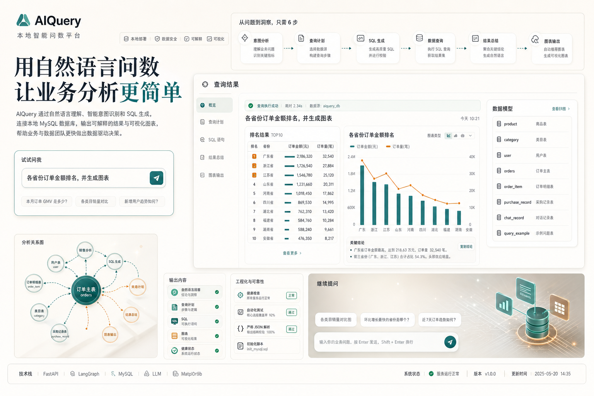
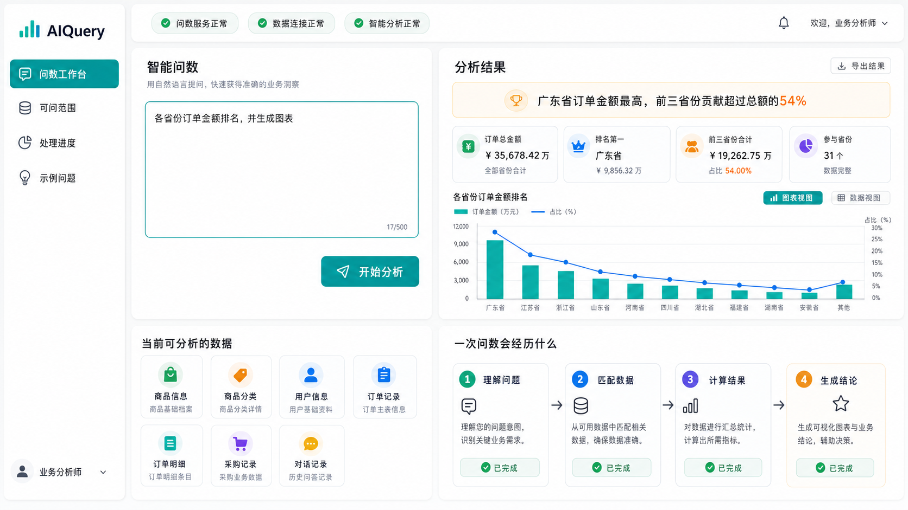

# AIQuery · 本地智能问数平台

AIQuery 是一个基于 FastAPI、LangGraph、MySQL 和大语言模型的本地智能问数平台。它能够将自然语言业务问题解析为结构化查询计划，读取 `ai_query` 数据库，生成业务结论，并在适合的场景下自动输出图表。

## 项目预览





## 功能亮点

- **自然语言问数**：支持用中文查询 GMV、订单量、销售额、地区排名和品类对比等业务指标。
- **意图分析**：通过 LLM 生成结构化查询计划，识别目标表、字段、聚合方式、排序和筛选条件。
- **安全查询**：结合数据库元数据和白名单校验生成 SQL，降低错误表名和字段名带来的风险。
- **结果总结**：将查询结果整理为适合业务阅读的自然语言结论。
- **自动图表**：支持柱状图、条形图、折线图和饼图等常见可视化输出。
- **会话上下文**：通过 `session_id` 保存对话记录，支持连续追问。
- **Web 工作台**：内置响应式前端，包含问题输入、结果展示、数据模型、系统状态和执行链路。

## 技术栈

| 类型 | 技术 |
| --- | --- |
| 后端 | Python 3.12+、FastAPI、Uvicorn |
| 工作流 | LangGraph、LangChain Core |
| 模型 | OpenAI-compatible LLM API |
| 数据库 | MySQL、PyMySQL |
| 可视化 | Matplotlib |
| 前端 | HTML、CSS、原生 JavaScript |

## 数据模型

项目默认使用 `ai_query` 数据库，包含以下业务表：

| 逻辑表 | 物理表 | 说明 |
| --- | --- | --- |
| 商品表 | `product` | 商品、价格、库存和品类 |
| 品类表 | `category` | 商品品类层级 |
| 用户表 | `user` | 用户与会员信息 |
| 订单主表 | `orders` | 订单成交、GMV、渠道和地区 |
| 订单明细表 | `order_item` | 订单行、销量和行金额 |
| 采购记录表 | `purchase_record` | 历史采购流水 |
| 对话记录表 | `chat_record` | 问答审计记录 |
| 问数示例表 | `query_example` | 示例问题 |

## 快速开始

### 1. 创建虚拟环境

```powershell
python -m venv .venv
.venv\Scripts\activate
```

### 2. 安装依赖

```powershell
pip install -e .
```

### 3. 配置环境变量

```powershell
Copy-Item .env.example .env
```

至少需要配置：

```text
LLM_API_KEY=你的模型 API Key
DB_HOST=127.0.0.1
DB_PORT=3306
DB_USER=root
DB_PASSWORD=你的数据库密码
DB_NAME=ai_query
```

### 4. 初始化 MySQL

```powershell
mysql -h 127.0.0.1 -P 3306 -u root -p < scripts/init_mysql.sql
```

### 5. 启动服务

```powershell
python run.py --server
```

启动后访问：

- Web 工作台：<http://localhost:8000>
- 健康检查：<http://localhost:8000/health>

## 使用方式

### CLI 问数

```powershell
python run.py -q "本月订单 GMV 是多少？"
```

### API 请求

```http
POST /run
Content-Type: application/json
```

```json
{
  "user_question": "各省份订单金额排名，并生成图表",
  "session_id": "demo-session"
}
```

### API 列表

| 方法 | 路径 | 说明 |
| --- | --- | --- |
| `GET` | `/` | 返回前端工作台 |
| `POST` | `/run` | 执行自然语言问数 |
| `GET` | `/examples` | 获取示例问题 |
| `GET` | `/tables` | 获取可用数据表 |
| `GET` | `/health` | 检查服务、数据库和 LLM 配置 |
| `GET` | `/static/charts/{filename}` | 访问生成的图表 |

## 项目结构

```text
.
├── config/                 # LLM 提示词与输出配置
├── docs/assets/            # 项目原型和展示素材
├── frontend/               # Web 前端页面
├── scripts/                # MySQL 初始化脚本
├── src/
│   ├── graphs/             # LangGraph 工作流与节点
│   ├── llm/                # LLM 客户端封装
│   ├── query/              # 查询计划与 SQL 生成
│   ├── storage/            # 数据库访问与元数据
│   └── tools/              # 图表生成工具
├── tests/                  # 单元测试
├── pyproject.toml          # 项目依赖配置
└── run.py                  # CLI / Web 启动入口
```

## 测试

项目内置不依赖真实 MySQL 和 LLM 的核心单元测试：

```powershell
python -m unittest discover -s tests -v
```

测试覆盖 LLM JSON 解析、会话历史格式化、查询计划校验、SQL 生成和健康检查接口。

## 注意事项

- `.env`、`.venv/`、缓存目录、运行日志和生成图表默认不会提交到 Git。
- 服务运行前请确认 MySQL 可连接，并已执行 `scripts/init_mysql.sql`。
- 数据库表结构发生变化后，重启服务以重新加载元数据。
- 图表生成依赖 Matplotlib，Windows 环境首次运行可能会创建本地字体缓存。

## License

本项目用于本地开发、课程设计和功能演示。
